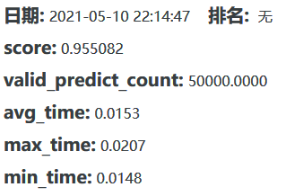

# 全球人工智能技术创新大赛 赛道三: 小布助手对话短文本语义匹配

  

最终结果   
AUC：0.955082  
Rank: 18（天池官网），16（最终名单）  
比赛链接：[LINK](https://tianchi.aliyun.com/competition/entrance/531851/introduction  )

如有任何疑问，欢迎提issue，或者通过邮箱ustcpfluo@gmail.com联系我。  
If you have any problem, please feel free to open an issue or send an email to ustcpfluo@gmail.com.

## 方案
4个模型集成，2个nezha_cn_base，2个nezha_base_wwm 。（预训练权重下载地址 [LINK](https://github.com/lonePatient/NeZha_Chinese_PyTorch)）

### 预训练
使用3gram mask 做预训练，同样预训练的模型使用不同的种子(42, 43)和不同的mask概率(0.15, 0.175)来扩大差异化，具体参数可以参考/code/run.sh
### 微调
所有模型全量数据微调4个epoch, 使用FGM对抗训练，eps=0.6，multi_dropout=10，微调结束后所有模型自动转为onnx
### 推断
使用多进程加载4个模型到一张显卡上，多进程推断相比于串行推断平均推断时间减少20%。因此可以恰好放下4个模型，不会超时。

## 文件目录
```

│  Dockerfile
│  README.md
│  requirements.txt
│  sources.list
├─code
│  configuration_nezha.py
│  data_helper.py
│  inf.py
│  modeling_bert.py
│  modeling_nezha.py
│  model_nezha_finetune.py
│  model_nezha_predict.py
│  model_nezha_pretrain.py
│  ngram.py
│  ngram_albert.py
│  run.sh
│  utils.py
└─user_data
    ├─logs
    ├─model_data
    │  ├─download
    │  │  ├─nezha_base_wwm
    │  │  │      config.json
    │  │  │      pytorch_model.bin
    │  │  │
    │  │  └─nezha_cn_base
    │  │          config.json
    │  │          pytorch_model.bin
    │  │          vocab.txt
    │  │
    │  ├─finetune
    │  ├─onnx
    │  └─pretrain
    ├─tokenizer_data
    │      special_tokens_map.json
    │      tokenizer_config.json
    │      vocab.txt
    │
    ├─tsv_data
    │      gaiic_track3_round1_testA_20210228.tsv
    │      gaiic_track3_round1_testB_20210317.tsv
    │      gaiic_track3_round1_train_20210228.tsv
    │      gaiic_track3_round2_train_20210407.tsv
    │
    └─vocab_data
            vocab.json
            vocab.txt
```